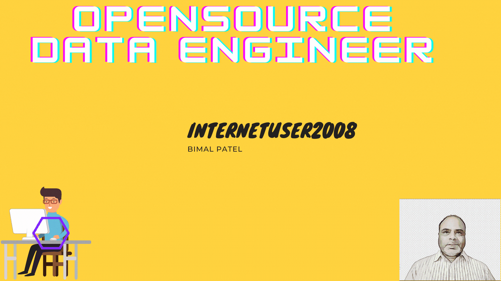
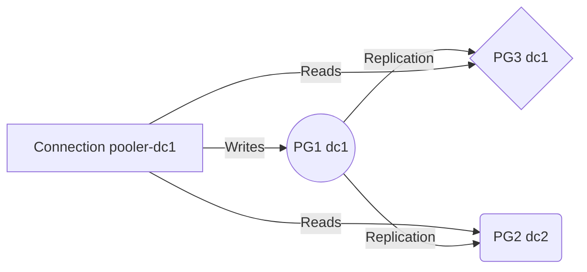

<!-- <h2 align='center'>
**internetuser2008/Bimal.Patel** is a ✨ _special_ ✨ repository because its `Data Engineer/DevOps` </h2> (this file) appears on your GitHub profile.
-->
### Hi there 👋

 

- 🔭 I’m Open Source Database Engineer
- 🌱 I’m currently learning Everything!!!
- 👯 I’m looking to collaborate Renformenet Learning
- 🤔 I’m looking for help with ...
- 💬 Ask me about Postgres
- 📫 How to reach me: 
- 😄 Pronouns: ...
- ⚡ Fun fact: ...
-->

## SmartyPants

SmartyPants converts ASCII punctuation characters into "smart" typographic punctuation HTML entities. For example:

|                |ASCII                          |HTML                         |
|----------------|-------------------------------|-----------------------------|
|Single backticks|`'Isn't this fun?'`            |'Isn't this fun?'            |
|Quotes          |`"Isn't this fun?"`            |"Isn't this fun?"            |
|Dashes          |`-- is en-dash, --- is em-dash`|-- is en-dash, --- is em-dash|

## PG Cluster

